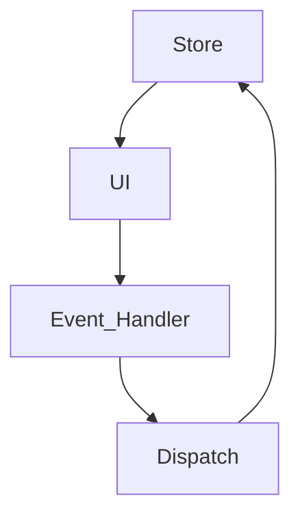

# Getting started with react-redux

Redux is a nightmare to many. I too had problem understanding redux when I started learning it, cause there was a lot of boilerplate code, did not understood the store properly and everything seemed too complex. But I kept at it until I got the hang of it. I will try to describe it in simple terms here, so that anyone can understand the basic of redux.

I have created a demo project at [CodeSanxbox](https://codesandbox.io/s/redux-toolkit-q0qcyp?file=/src/index.js). It's a [todo](https://codesandbox.io/s/redux-toolkit-q0qcyp?file=/src/index.js) app that uses redux to control its state. You can follow along the project if you want.
<p align="center">
  
</p>

## What is Redux?
For those who are new to redux, it is a JavaScript library to control your application states. If you have the basic knowledge of react, you know that an application can have multiple states, but maintaining states seperately becomes hassle when the same state has to be used in multiple components. We can use **React Context**, but there is problem with using it. We know that react renders application when a state changes. But we don't want to render the whole application just because of a simple state change somewhere. In this case, redux comes to the rescue.



What redux does is, it maintains a single source of truth for your application. The states are kept at a store, and you can not modify states directly. You have to dispatch an action to change any state. And reducers are the way to do so. Data is taken from state and shown in the UI. And any event that changes a state is handeld through event handlers. Event handlers dispatches an action to the reducer that is kept into the store. And the reducer processes the action and updates the state. Now, you are confused. What is a store, action and reducers? You should be. Because redux is all about these 3 things. I will try to describe it in simple terms.

## Describe Redux to a 5 year old
The key points to remember about redux are:
- Store
- Reducer
- Action

Let's try to understand it using an example. Our characters name is John.

**[Store]** : John keeps his money in the bank. One day he wanted to take out some of his money from the bank. So, he thought he should go to the bank to do so. He got ready and went to the bank. Banks keep their money in the vault. So think of a redux store as a bank vault. All the application states are kept into it.

**[Reducer]** : Now, after going to the bank, John could get into the vault and take out some money, because it's his money. But that's illegal, and John can not do that. The bank keeps record of how much money is in the vault and how much money is in a persons account. So what John does after going to the bank is, he goes to the managers office and tells him that he needs to take out some money from his account. Here the bank manager can be compared as reducer in redux. States can only be changed using reducers.

**[Action]** : After hearing upon his request, the bank manager asks John for a check and tells one of his employee to take out some money from the vault and update Johns account. This can be compared to an action in redux. Reducers uses action to update states. And actions can be dispatched from anywhere in the application.

## Installation
We will be using @reduxjs/toolkit, which is a standard way for writing redux logic now. To get started create a react application with ```create-react-app```. Now we have to install redux packages. Open a terminal within the project directory and install using ```npm```
```
npm install @reduxjs/toolkit react-redux
```
or if you use ```yarn``` then 
```
yarn add @reduxjs/toolkit react-redux
```
## Create a Redux Store
First of all, create a new folder in your ```/src``` directory. Let's name it as redux. Within redux directory create a file named ```/src/redux/store.js```. Paste the code from below within that file.
```jsx
import { configureStore } from '@reduxjs/toolkit';
export default configureStore({
  reducer:{}
});
```
Initially, the reducer object is empty. We can add as many reducers as we want within this object. We will populate it as we go along the project.

## Provide the Redux Store to React 
Once the store has been created, we need to make it available to the components of the application. If you are familiar with React Context, then you know that we need to wrap the App component with context provider to make it available to all components. Same logic is applied here, but we apply it in the top level, in ```/src/index.js```. We import ```<Provider>``` from react-redux and wrap the ``<App/>`` component with it. This way, the store can be accessed from anywhere in the project directory.

```JSX
import { StrictMode } from "react";
import { createRoot } from "react-dom/client";
import App from "./App";

import store from "./redux/store";
import { Provider } from "react-redux";

const rootElement = document.getElementById("root");
const root = createRoot(rootElement);

root.render(
  <StrictMode>
    <Provider store={store}>
      <App />
    </Provider>
  </StrictMode>
);

```

## Create a Redux State Slice
Wait! this is new. Where did slice came from? let's talk a bit about it. You can think of ```slice``` in this manner, this is a codeblock that holds you reducer and as well as actions. Let's compare your application stores ```reducer``` object with a pizza. But this pizza is cut into multiple slices and all the slices are of different toppings. Because this is a special pizza, the slices are taken from different pizzas to make a whole new. You can compare slices to different reducers that is responsible for only one specific state. A slice holds one reducer and actions regarding that specific reducer.

<p align="center">
  
</p>

Let's create a file named ```/src/redux/todoSlice.js``` and import the ```createSlice``` API from Redux toolkit. A slice is comprised of ```name```, ```initialState``` and ```reducers```.

```JSX
import { createSlice } from "@reduxjs/toolkit";

export const todoSlice = createSlice({
  name: "todos",
  initialState: [
    { id: 1, title: "learn @reduxjs/toolkit", completed: false },
    { id: 2, title: "learn react-redux", completed: false },
    { id: 3, title: "learn about store", completed: false },
    { id: 4, title: "write a blog about redux", completed: true }
  ],
  reducers: {
    addTodo: (state, action) => {
      const todo = {
        id: new Date().toLocaleString(),
        title: action.payload.title,
        completed: false
      };
      state.push(todo);
    }
  }
});

export const { addTodo } = todoSlice.actions;

export default todoSlice.reducer;

```

The ```initialState``` holds the applications initial states. And ```reducers``` holds the reducer actions. You can see that there is an ```addTodo`` action in this codeblock. What this does is it creates a new todo object using the title field in payload that is passed down from anywhere in the application and updates the state. If you face difficulties in understanding payload, then I will suggest to take a look at _React Reducer_ and then continue with this doc.

We need to export the reducer by default and also the actions seperately, so that it can be imported in any file within the applicatin directory.


## Update the Store
We have created the slice, but the system has no idea of its existance till now. In this stage, we have to update the store and add the reducer to the store. After only adding the store, it can provide the state wherever it is needed.
The updated code of the ```/src/redux/store.js``` file looks like,

```jsx
import { configureStore } from "@reduxjs/toolkit";
import todoReducer from "./todoSlice";

export default configureStore({
  reducer: {
    todos: todoReducer
  }
});
```

## Acccessing the state
We can use the ```useSelector``` react-redux hook to acces the state. In our example, the state is an array of objects. We first accessed the data and shown it in the UI like list items.
```jsx
import { useSelector } from "react-redux";

const ListItems = () => {
  const todos = useSelector((state) => state.todos);
  return (
    <div className="todos-container">
      {todos.map((todo) => {
        return (
          <Item
            key={todo.id}
            id={todo.id}
            title={todo.title}
            completed={todo.completed}
          />
        );
      })}
    </div>
  );
};
```

## Dispatch an Action
An action has to be dispatched to update any state. It is a simple function that takes the action function as a parameter. The action function then takes payload as its parameter.

```jsx
import { useState } from "react";
import { useDispatch } from "react-redux";
import { addTodo } from "../redux/todoSlice";

const AddTodoForm = () => {
  const dispatch = useDispatch();
  const [value, setValue] = useState("");
  const handleSubmit = (e) => {
    e.preventDefault();
    if (value) {
      dispatch(
        addTodo({
          title: value
        })
      );
      setValue("");
    }
  };
  return (
    <form onSubmit={handleSubmit}>
      <input
        type="text"
        placeholder="add todo ..."
        value={value}
        onChange={(e) => setValue(e.target.value)}
      />
      <button type="submit">Submit</button>
    </form>
  );
};

export default AddTodoForm;
```
